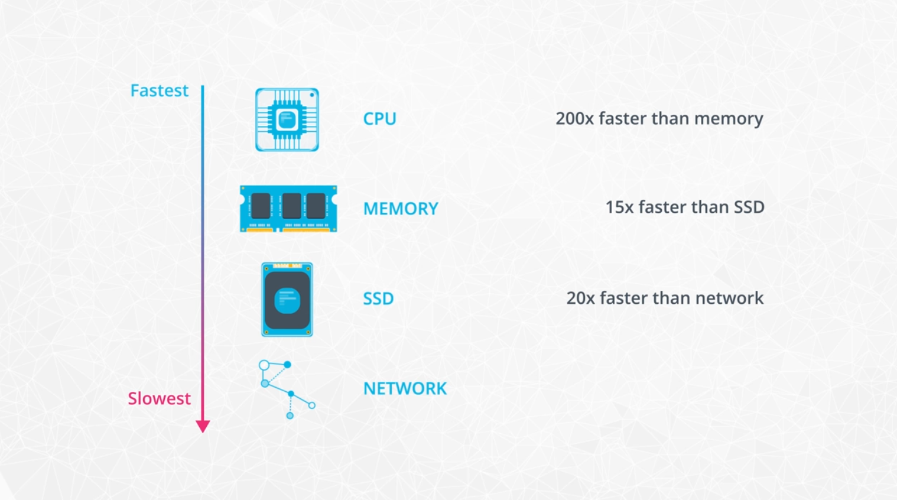
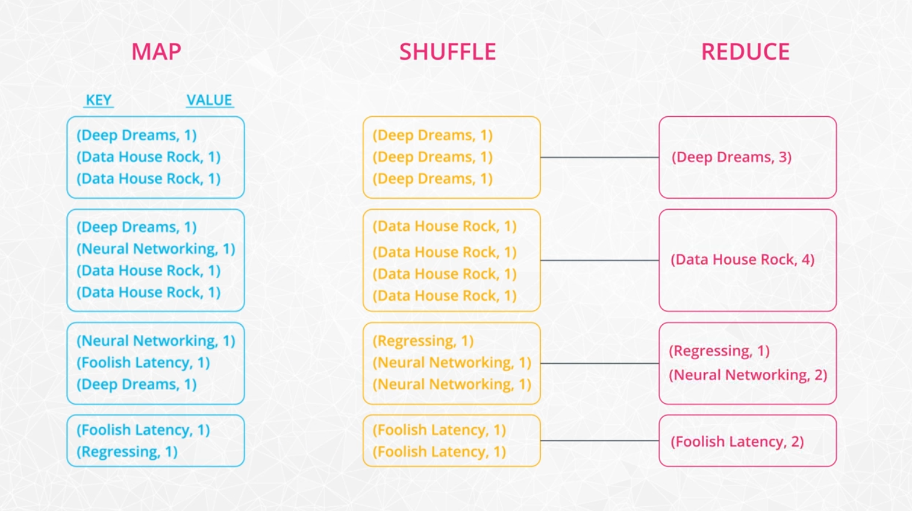

## About Spark

### Small Data

If your dataset is small enough to be handled in a reasonable amount of time on a single machine (i.e. a Python script on your laptop), this does not warrant the use of distributed computing, so Spark would be overkill.

### Big Data

Parallel processing required for larger datasets that greatly exceed a single machine's memory capacity. Moving data from storage to memory and back is extremely slow in comparison to the CPU's processing speed, and with a large queue of data, the CPU **thrashes** trying to move data back (raw) and forth (processed) quickly.

### Medium Data

The size of the dataset is not the only parameter for classifying it as "big data." If you're training a sophisticated neural network on 2GB of data, this could be considered a big data problem; whereas if you're running a simple SQL query on 10GB of data, this would likely not warrant a big data solution (parallel processing).

### Hadoop Ecosystem

**Hadoop** - an ecosystem of tools for big data storage and data analysis. Hadoop is an older system than Spark but is still used by many companies. The major difference between Spark and Hadoop is how they use memory. Hadoop writes intermediate results to disk whereas Spark tries to keep data in memory whenever possible. This makes Spark faster for many use cases.

**Hadoop MapReduce** - a system for processing and analyzing large data sets in parallel.

**Hadoop YARN** - a resource manager that schedules jobs across a cluster. The manager keeps track of what computer resources are available and then assigns those resources to specific tasks.

**Hadoop Distributed File System (HDFS)** - a big data storage system that splits data into chunks and stores the chunks across a cluster of computers.

**Apache Pig** - a SQL-like language that runs on top of Hadoop MapReduce

**Apache Hive** - another SQL-like interface that runs on top of Hadoop MapReduce

Oftentimes when someone is talking about Hadoop in general terms, they are actually talking about Hadoop MapReduce. However, Hadoop is more than just MapReduce. In the next part of the lesson, you'll learn more about how MapReduce works.

#### Spark in relation to Hadoop

Spark, which is the main focus of this course, is another big data framework. Spark contains libraries for data analysis, machine learning, graph analysis, and streaming live data. Spark is generally faster than Hadoop. This is because Hadoop writes intermediate results to disk whereas Spark tries to keep intermediate results in memory whenever possible.

The Hadoop ecosystem includes a distributed file storage system called HDFS (Hadoop Distributed File System). Spark, on the other hand, does not include a file storage system. You can use Spark on top of HDFS but you do not have to. Spark can read in data from other sources as well such as Amazon S3.

#### Streaming Data

Data streaming is a specialized topic in big data. The use case is when you want to store and analyze data in real-time such as Facebook posts or Twitter tweets.

Spark has a streaming library called [Spark Streaming](https://spark.apache.org/docs/latest/streaming-programming-guide.html) although it is not as popular and fast as some other streaming libraries. Other popular streaming libraries include [Storm](http://storm.apache.org/) and [Flink](https://flink.apache.org/). Streaming won't be covered in this course, but you can follow these links to learn more about these technologies.

### MapReduce

MapReduce is a programming technique for manipulating large data sets. "Hadoop MapReduce" is a specific implementation of this programming technique.

The technique works by first dividing up a large dataset and distributing the data across a cluster. In the map step, each data is analyzed and converted into a (key, value) pair. Then these key-value pairs are shuffled across the cluster so that all keys are on the same machine. In the reduce step, the values with the same keys are combined together.

While Spark doesn't implement MapReduce, you can write Spark programs that behave in a similar way to the map-reduce paradigm. In the next section, you will run through a code example.

See [mapreduce notebook](../code/mapreduce_practice.ipynb) for example.

### Spark Modes

**Local** - Single machine
**Standalone** (cluster) - Spark cluster manager
**YARN** (cluster) - Hadoop cluster manager
**Mesos** (cluster) - UC Berkley open source cluster manager

### Spark Use Cases

Use cases and accompanying documentation:

* [Data Analytics](http://spark.apache.org/sql/)
* [Machine Learning](http://spark.apache.org/mllib/)
* [Streaming](http://spark.apache.org/streaming/)
* [Graph Analytics](http://spark.apache.org/graphx/)

Spark is meant for big data sets that cannot fit on one computer. But you don't need Spark if you are working on smaller data sets. In the cases of data sets that can fit on your local computer, there are many other options out there you can use to manipulate data such as:

[AWK](https://en.wikipedia.org/wiki/AWK) - a command line tool for manipulating text files
[R](https://www.r-project.org/) - a programming language and software environment for statistical computing
[Python PyData Stack](https://pydata.org/downloads.html), which includes pandas, Matplotlib, NumPy, and scikit-learn among other libraries

Sometimes, you can still use pandas on a single, local machine even if your data set is only a little bit larger than memory. Pandas can read data in chunks. Depending on your use case, you can filter the data and write out the relevant parts to disk.

If the data is already stored in a relational database such as [MySQL](https://www.mysql.com/) or [Postgres](https://www.postgresql.org/), you can leverage SQL to extract, filter and aggregate the data. If you would like to leverage pandas and SQL simultaneously, you can use libraries such as [SQLAlchemy](https://www.sqlalchemy.org/), which provides an abstraction layer to manipulate SQL tables with generative Python expressions.

The most commonly used Python Machine Learning library is [scikit-learn](http://scikit-learn.org/stable/). It has a wide range of algorithms for classification, regression, and clustering, as well as utilities for preprocessing data, fine tuning model parameters and testing their results. However, if you want to use more complex algorithms - like deep learning - you'll need to look further. [TensorFlow](https://www.tensorflow.org/) and [PyTorch](https://pytorch.org/) are currently popular packages.

#### Limitations

Spark Streaming’s latency is at least 500 milliseconds since it operates on micro-batches of records, instead of processing one record at a time. Native streaming tools such as [Storm](http://storm.apache.org/), [Apex](https://apex.apache.org/), or [Flink](https://flink.apache.org/) can push down this latency value and might be more suitable for low-latency applications. Flink and Apex can be used for batch computation as well, so if you're already using them for stream processing, there's no need to add Spark to your stack of technologies.

Another limitation of Spark is its selection of machine learning algorithms. Currently, Spark only supports algorithms that scale linearly with the input data size. In general, deep learning is not available either, though there are many projects integrate Spark with Tensorflow and other deep learning tools.

#### Hadoop versus Spark

The Hadoop ecosystem is a slightly older technology than the Spark ecosystem. In general, Hadoop MapReduce is slower than Spark because Hadoop writes data out to disk during intermediate steps. However, many big companies, such as Facebook and LinkedIn, started using Big Data early and built their infrastructure around the Hadoop ecosystem.

While Spark is great for iterative algorithms, there is not much of a performance boost over Hadoop MapReduce when doing simple counting. Migrating legacy code to Spark, especially on hundreds of nodes that are already in production, might not be worth the cost for the small performance boost.

#### Beyond Spark for Storing and Processing Big Data

Keep in mind that Spark is not a data storage system, and there are a number of tools besides Spark that can be used to process and analyze large datasets.

Sometimes it makes sense to use the power and simplicity of SQL on big data. For these cases, a new class of databases, know as NoSQL and NewSQL, have been developed.

For example, you might hear about newer database storage systems like [HBase](https://hbase.apache.org/) or [Cassandra](http://cassandra.apache.org/). There are also distributed SQL engines like [Impala](https://impala.apache.org/) and [Presto](https://prestodb.io/). Many of these technologies use query syntax that you are likely already familiar with based on your experiences with Python and SQL.

In the lessons ahead, you will learn about Spark specifically, but know that many of the skills you already have with SQL, Python, and soon enough, Spark, will also be useful if you end up needing to learn any of these additional Big Data tools.
