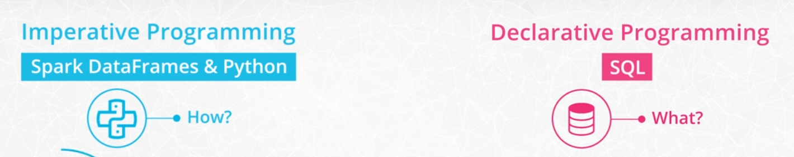

## Data Wrangling

### Functional Programming

Spark is written in Scala, a functional programming language. Functional programming languages are ideal for distributed computing, unlike procedural programming languages (like Python) which operative sequentially.

PySpark is an API wrapper that allows developers to code in Spark using Python and ensures that your code uses functional programming practices. Underneath the hood, the Python code uses `py4j` to make calls to the Java Virtual Machine (JVM).

[Functional Programming Notebook](../code/1_procedural_vs_functional_in_python.ipynb)

DAGs (directed acyclic graphs) batch together steps into "meta-steps" in order to mitigate thrashing and speed up the parallel processing. This process is akin to a recipe, whereby the cook would gather all the ingredients from their respective locations first (meta-step 1), combine all first ingredients (meta-step 2), and so on, instead of gathering one ingredient, adding it to the bowl, then gathering the next ingredient, adding it to the mixture, etc.

#### Map and Lambda Functions

[Blog post on lambda functions](http://palmstroem.blogspot.com/2012/05/lambda-calculus-for-absolute-dummies.html).

[Map and Lambda Function Notebook](../code/2_spark_maps_and_lazy_evaluation.ipynb)

### Read/Write Data

Processing big data using distribued computing often implies the need for distributed data storage as well. [Amazon S3](https://aws.amazon.com/s3/) and [HDFS](https://hadoop.apache.org/docs/r1.2.1/hdfs_design.html) are 2 popular tools for distributed data storage.

### Spark Environment and Spark APIs

The first part of any Spark program is the `SparkContext`, which is the main entry point for Spark functionality and connects the cluster with the application.

```python
from pyspark import SparkContext, SparkConf

configuration = SparkConf().setAppName('app-name').setMaster('local')
sc = SparkContext(conf = configuration)
```

Next is the `SparkSession`:

```python
from pyspark.sql import SparkSession

spark = SparkSession \
  .builder \
  .appName('app-name') \
  .config('config option', 'value') \
  .getOrCreate()

# Output all configuration values
spark.sparkContext.getConf().getAll()
```

[Sample Spark project](../code/3_data_inputs_and_outputs.ipynb)

If Spark is used in a cluster mode all the worker nodes need to have access to the input data source. If you're trying to import a file saved only on the local disk of the driver node you'll receive an error message similar to this:

`AnalysisException: u'Path does not exist: file:/home/ubuntu/test.csv;'`

Loading the file should work if all the nodes have it saved under the same path.

#### Imperative vs Declarative Programming



[Data Wrangling with Spark](../code/4_data_wrangling.ipynb)

#### General Functions
  
We have used the following general functions that are quite similar to methods of pandas dataframes:

* `select()`: returns a new DataFrame with the selected columns
* `filter()`: filters rows using the given condition
* `where()`: is just an alias for `filter()`
* `groupBy()`: groups the DataFrame using the specified columns, so we can run aggregation on them
* `sort()`: returns a new DataFrame sorted by the specified column(s). By default the second parameter 'ascending' is True.
* `dropDuplicates()`: returns a new DataFrame with unique rows based on all or just a subset of columns
* `withColumn()`: returns a new DataFrame by adding a column or replacing the existing column that has the same name. The first parameter is the name of the new column, the second is an expression of how to compute it.

#### Aggregate functions

Spark SQL provides built-in methods for the most common aggregations such as `count()`, `countDistinct()`, `avg()`, `max()`, `min()`, etc. in the pyspark.sql.functions module. These methods are not the same as the built-in methods in the Python Standard Library, where we can find `min()` for example as well, hence you need to be careful not to use them interchangeably.

In many cases, there are multiple ways to express the same aggregations. For example, if we would like to compute one type of aggregate for one or more columns of the DataFrame we can just simply chain the aggregate method after a `groupBy()`. If we would like to use different functions on different columns, `agg()` comes in handy. For example `agg({"salary": "avg", "age": "max"})` computes the average salary and maximum age.

#### User defined functions (UDF)

In Spark SQL we can define our own functions with the udf method from the pyspark.sql.functions module. The default type of the returned variable for UDFs is string. If we would like to return an other type we need to explicitly do so by using the different types from the pyspark.sql.types module.
Window functions

Window functions are a way of combining the values of ranges of rows in a DataFrame. When defining the window we can choose how to sort and group (with the `partitionBy` method) the rows and how wide of a window we'd like to use (described by `rangeBetween` or `rowsBetween`).

For further information see the [Spark SQL, DataFrames and Datasets Guide](https://spark.apache.org/docs/latest/sql-programming-guide.html) and the [Spark Python API Docs](https://spark.apache.org/docs/latest/api/python/index.html).

[Sparkify exercises](../code/5_dataframe_quiz.ipynb)

[Sparkify personal solutions](../code/5_dataframe_quiz_complete.ipynb)

[Sparkify Udacity solutions](../code/6_dataframe_quiz_solution.ipynb)

#### Spark SQL

Here are a few resources that you might find helpful when working with Spark SQL

* [Spark SQL built-in functions](https://spark.apache.org/docs/latest/api/sql/index.html)
* [Spark SQL guide](https://spark.apache.org/docs/latest/sql-getting-started.html)

First, create or replace a temporary view to query against:

```python
user_log.createOrReplaceTempView("user_log_table")
```

Then, run a SQL query against the temporary view:

```python
spark.sql("SELECT * FROM user_log_table LIMIT 2").show()
```

You can also use multi-line strings to run queries:

```python
spark.sql('''
          SELECT *
          FROM user_log_table
          LIMIT 2
          ''').show()
```

[Example Spark SQL Notebook](../code/7_data_wrangling-sql.ipynb)

Both Spark SQL and Spark Data Frames are part of the Spark SQL library. Hence, they both use the Spark SQL Catalyst Optimizer to optimize queries. 

You might prefer SQL over data frames because the syntax is clearer especially for teams already experienced in SQL.

Spark data frames give you more control. You can break down your queries into smaller steps, which can make debugging easier. You can also [cache](https://unraveldata.com/to-cache-or-not-to-cache/) intermediate results or [repartition](https://hackernoon.com/managing-spark-partitions-with-coalesce-and-repartition-4050c57ad5c4) intermediate results.

[Spark SQL exercises](../code/notebook/8_spark_sql_quiz.ipynb)

[Spark SQL personal solutions](../code/notebook/8_spark_sql_quiz_complete.ipynb)

[Spark SQL Udacity solutions](../code/notebook/9_spark_sql_quiz_solution.ipynb)

### RDD API

RDDs are a low-level abstraction of the data. In the first version of Spark, you worked directly with RDDs. You can think of RDDs as long lists distributed across various machines. You can still use RDDs as part of your Spark code although data frames and SQL are easier. This course won't go into the details of RDD syntax, but you can find some further explanation of the difference between RDDs and DataFrames in Databricks' [A Tale of Three Apache Spark APIs: RDDs, DataFrames, and Datasets](https://databricks.com/blog/2016/07/14/a-tale-of-three-apache-spark-apis-rdds-dataframes-and-datasets.html) blog post.

Here is a link to the Spark documentation's [RDD programming guide](https://spark.apache.org/docs/latest/rdd-programming-guide.html).


